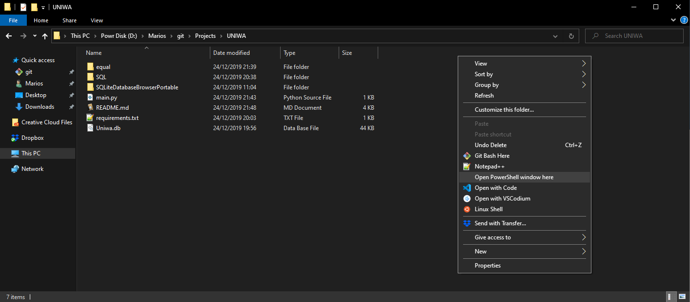
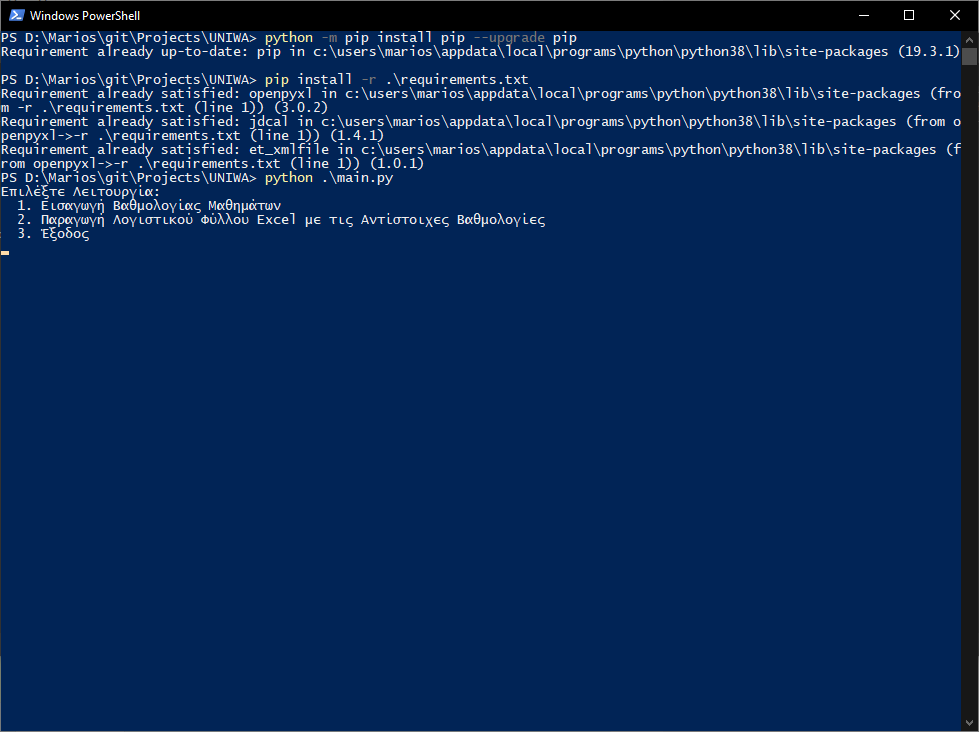
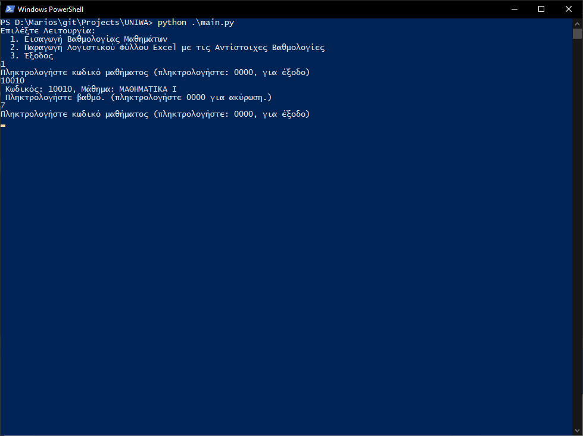
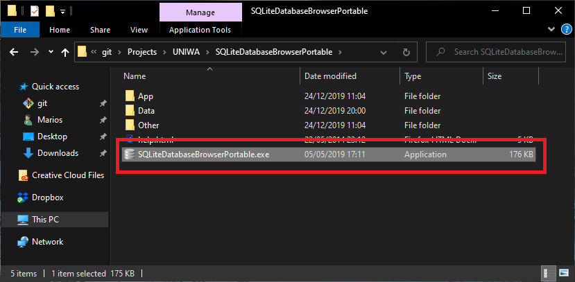
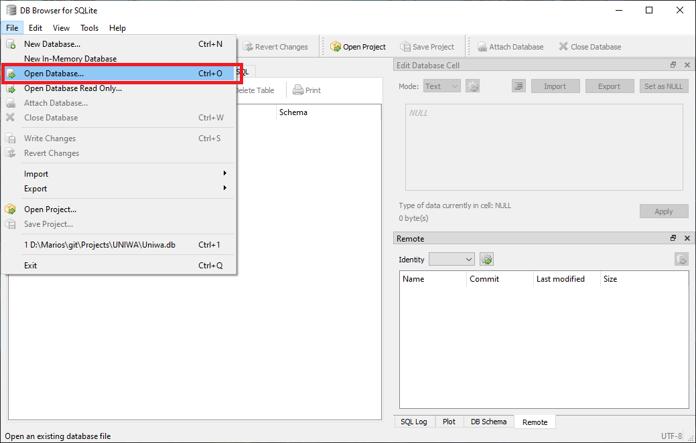
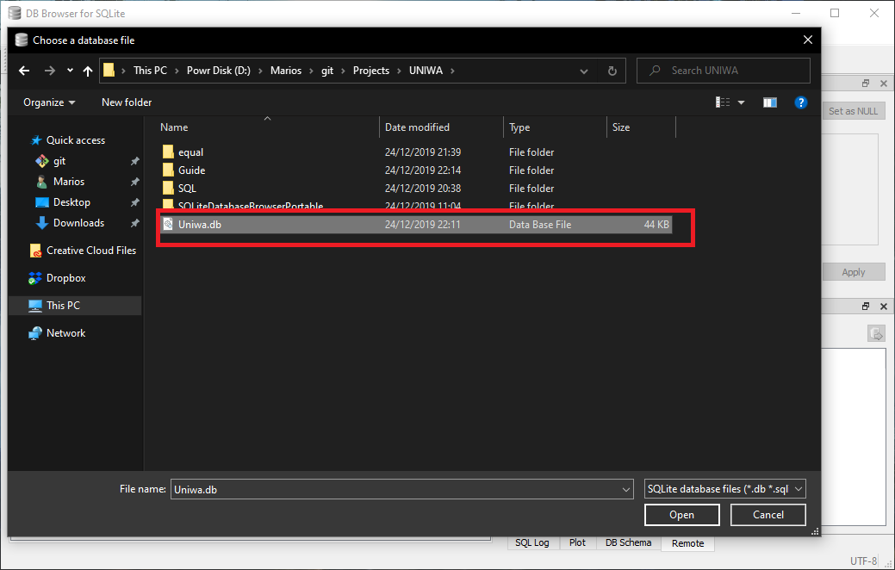
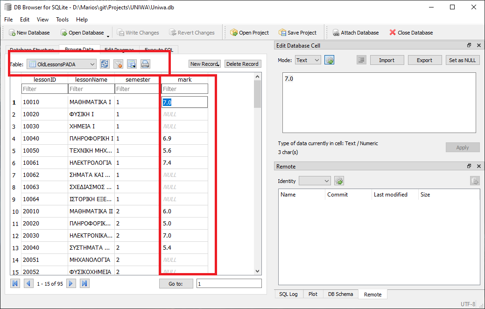
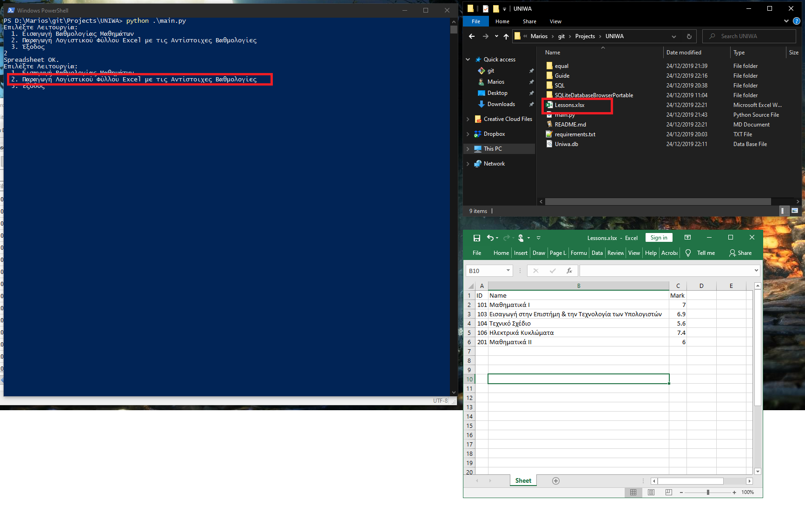

# ΠΡΟΓΡΑΜΜΑ ΑΝΤΙΣΤΟΙΧΙΣΗΣ ΒΑΘΜΟΛΟΓΙΑΣ 5ΕΤΟΥΣ ΑΠΟ 4ΕΤΟΥΣ

## Περιγραφή

Το συγκεκριμένο πρόγραμμα, κάνει αυτόματη αντιστοιχία βαθμολογιών από το παλαιό πρόγραμμα σπουδών και χρησιμοποιήθηκαν οι εξής πηγές για την κατασκευή Βάση Δεδομένων:

- [Παλαιό Πρόγραμμα Σπουδών](http://idpe.uniwa.gr/news/dept-news/79-idpe-undergraduate)
- [5ετες Πρόγραμμα Σπουδών](http://idpe.uniwa.gr/pgprogram-menu/graduate-studies/studies-program)
- [Αντιστοιχίσεις Μαθημάτων](http://idpe.uniwa.gr/news/dept-news/499-antistoixiseis-mathimaton)

### Γράφτηκε με

- Python 3.8
- SQL

## ΟΔΗΓΙΕΣ ΧΡΗΣΗΣ

Α. Εγκατάσταση Python & Εκτέλεση Προγράμματος

  1. Απαιτείται η [Python 3.8](https://www.python.org/downloads/)
  2. Κατεβάζουμε το πρόγραμμα σε αρχείο zip και το κάνουμε εξαγωγή σε κάποιο φάκελο
  3. Ανοιγούμε τον φάκελο, πατάμε δεξί κλικ στο κενό του φακελού και επιλέγουμε "Open Powershell Window Here"
    
  4. Πληκτρολογούμε τις Παρακάτω Εντολές με την σειρά

      ```powershell
      python -m pip install pip --upgrade pip
      pip install -r .\requirements.txt
      python .\main.py
      ```

      

Β. Εισαγωγή Βαθμολογίας Μαθημάτων
  - Τρόπος Α
    - Επιλέγουμε την 1η Επιλογή και Πληκτρολογούμε τον Κωδικό Μαθήματος και την Βαθμολογία του.
    
  - Τρόπος Β
    - Ανοιγούμε την Βάση Δεδομένων με το SQL Lite και κάνουμε εισαγωγή τις Βαθμολογίες στον Πίνακα OldLessons
    
    
    
    
    

Γ. Παραγωγή Λογιστικού Φύλλου EXCEL
  - Από το Πρόγραμμα Επιλέγουμε την Επιλογή 2 και το πρόγραμμα διαβάζει την βάση δεδομένων και κάνει παραγωγή το λογιστικό φύλλο
  

## ΣΗΜΕΙΩΣΕΙΣ

Στο έγγραφο αντιστοιχίες μαθημάτων 5ετους με 4ετους πρέπει να υπάρχουν λάθη και είναι τα εξής:

- **307 ΣΗΜΑΤΑ ΚΑΙ ΣΥΣΤΗΜΑΤΑ** όπου αντιστοιχεί με το Μάθημα 60051 ΨΗΦΙΑΚΟΣ ΕΛΕΓΧΟΣ. Ο κωδικός 60051 αντιστοιχούσε στο Μάθημα ΨΗΦΙΑΚΗ ΕΠΕΞΕΡΓΑΣΙΑ ΣΗΜΑΤΟΣ. Επειδή το μάθημα ΣΗΜΑΤΑ ΚΑΙ ΣΥΣΤΗΜΑΤΑ έχει θέμα την Επεξεργασία & Μελέτη Σημάτων, το πρόγραμμα το αντιστοιχεί με το μάθημα 50041 ΨΗΦΙΑΚΗ ΕΠΕΞΕΡΓΑΣΙΑ ΣΗΜΑΤΟΣ.
- **404 ΣΧΕΔΙΑΣΗ ΚΑΙ ΠΡΟΓΡΑΜΜΑΤΙΣΜΟΣ ΣΥΣΤΗΜΑΤΩΝ ΕΦΟΔΙΑΣΜΟΥ (LOGISTICS)**. Ο κωδικός 404 αντιστοιχεί στα ΔΙΚΤΥΑ ΥΠΟΛΟΓΙΣΤΩΝ. Το πρόγραμμα το αντιστοιχεί με τον κωδικό 505.
- **505 ΔΙΚΤΥΑ ΥΠΟΛΟΓΙΣΤΩΝ**. Ο κωδικός 505 αντιστοιχεί στην ΣΧΕΔΙΑΣΗ ΚΑΙ ΠΡΟΓΡΑΜΜΑΤΙΣΜΟΣ ΣΥΣΤΗΜΑΤΩΝ ΕΦΟΔΙΑΣΜΟΥ (LOGISTICS). Το πρόγραμμα το αντιστοιχεί με τον κωδικό 404.
- **912 ΜΕΘΟΔΟΙ ΨΗΦΙΑΚΟΥ ΕΛΕΓΧΟΥ ΚΑΙ ΠΑΡΑΤΗΡΗΣΗΣ** όπου αντιστοιχεί με το Μάθημα 60051 ΨΗΦΙΑΚΟΣ ΕΛΕΓΧΟΣ. Ο κωδικός 60051 αντιστοιχούσε στο Μάθημα ΨΗΦΙΑΚΗ ΕΠΕΞΕΡΓΑΣΙΑ ΣΗΜΑΤΟΣ. Αντικαταστήθηκε με τον Κωδικό 50041 όπου αντιστοιχεί κανονικά στο Μάθημα ΨΗΦΙΑΚΟ ΕΛΕΓΧΟ

## Log

Future Updates:

- Generate a Spreadsheet with all lessons.
- Calculate Average Mark for Diploma
- Calculate Passed Lessons

Version 0.5:

- User can insert his marks directly with Python3 or Edit the Database with SQL Lite
- Program can generate an Excel SpreadSheet with the Lesson Marks
